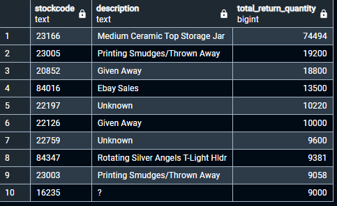
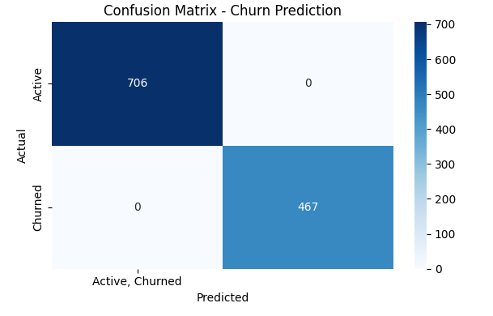

# Online Retail Data Analysis & Machine Learning Project
End-to-end online retail project starting with SQL for data cleaning and preparation, followed by Python-based machine learning for churn prediction, and concluding with Power BI dashboards for actionable business insights.

 

   _Image credit: istockphoto_

## Introduction
This project is a comprehensive analysis of an online retail dataset spanning 2009 to 2011, designed to demonstrate the full data workflow from raw data to actionable insights.
- SQL was used to clean, preprocess, and flag anomalies in over 500K+ transaction records.
- Python (Machine Learning) was applied to perform customer churn prediction using Recency, Frequency, and Monetary Values (RFM) features and a Random Forest Classifier, achieving 100% accuracy on the test set.
- Power BI was used to design interactive dashboards for stakeholders, delivering clear KPIs, trend analysis, and operational recommendations.

The skills highlighted throughout this project include data cleaning, exploratory analysis, predictive modeling, and data storytelling.

## Business Questions
* What are the revenue trends across time, product categories, and countries?
* Which products drive the most sales, and which ones are the most returned?
* What customer segments generate the most revenue?
* What is the Customer Lifetime Value (CLV) of the top customers?
* What are the peak shopping hours and days?
* Are there data quality or operational risks affecting performance?
* Can customer churn be predicted, and what actions can be taken to retain customers?
* How can we improve revenue and reduce returns and losses?

## Project Goals
* Clean and prepare the retail transaction data.
* Carry out advanced SQL analysis for business insights.
* Visualize key metrics and patterns in Power BI.
* Train a machine learning model to visualize customer churn.
* Create an interactive business-ready dashboard for stakeholders.

## Data Sourcing 
The dataset; containing 1,048,575 rows and 8 columns, was obtained from [Kaggle](https://www.kaggle.com/datasets/mashlyn/online-retail-ii-uci). The dataset has been uploaded as part of the files in this repository.

## Data Cleaning, Transformation, and Analysis.
Before cleaning the data, an SQL database, and table were created, and the dataset was imported into the table. All SQL queries for this project are available upon request, but some have been included as part of this project documentation.

### Data Cleaning
* **Null Values:** This query below was run to check for empty rows in the dataset:

```sql
SELECT
    COUNT(*) AS total_rows,
    COUNT(invoice) AS invoice_not_null,
    COUNT(stockcode) AS stock_code_not_null,
    COUNT(description) AS description_not_null,
    COUNT(quantity) AS quantity_not_null,
    COUNT(invoice_date) AS invoice_date_not_null,
    COUNT(price) AS price_not_null,
    COUNT(customer_id) AS customer_id_not_null,
    COUNT(country) AS country_not_null
FROM retail_transactions;
```


From the result, it was clear that the Description (description_not_null) and Customer ID (customer_id_not_null) columns had some missing values because they were the only columns that did not have 1,048,575 rows filled. The Description column had 4,372 null values, while the Customer ID had 236,682 null values (these could be completed transactions that have not been attributed to any customer). These null values were too much to erase from the data as it could affect the quality of analysis to be carried out. To prevent loss of data quality during analysis, the following actions were taken:
- Null values in the Description column were filled with "Unknown", and the first letter of every word in this column was capitalized (for uniformity).
- All null values in the Customer ID column were replaced with "Guest".


This was the outcome after the null values had been sorted. 

* **Duplicate Records:** This check was done to ensure that there were no repeated records or rows in the data to be analysed, using the SQL query:

```sql
SELECT
    invoice, stockcode, description, quantity,
    invoice_date, price, customer_id, country,
    COUNT(*) AS count
FROM retail_transactions
GROUP BY
    invoice, stockcode, description, quantity,
    invoice_date, price, customer_id, country
HAVING COUNT(*) > 1
ORDER BY count DESC;
```
This was the view of duplicate records:


The duplicate records were removed, and this reduced the total number of rows in the dataset to 1,014,425.  

* **Zero and Negative Values (Quantity and Price Columns):** Considering the possibility that there could be some returns or invalid transactions, the data was queried using the code:

```sql
SELECT COUNT(*) AS neg_quantities
FROM retail_transactions
WHERE quantity <= 0;
```

These showed that there were 22,244 rows with zero or negative quantity values. Assuming the quantity entries with negative (-ve) values are refunds/returns, and the rows of the quantity column with a value equal to zero (0) are invalid transactions, using a CASE statement:

```sql
SELECT
    CASE
      WHEN quantity < 0 THEN 'Negative (Return)'
      WHEN quantity = 0 THEN 'Zero (Invalid)'
    END AS quantity_type,
    COUNT(*) AS count
FROM retail_transactions
WHERE quantity <= 0
GROUP BY quantity_type;
```


The result of this query confirmed that no row of the quantity column had zero as the value. Upon running a similar query for the Price column, it was discovered that five (5) transactions had a negative price entry (where price was less than £0.00), and they all had "Adjust Bad Debt" as their product description, indicating debts that were unlikely to be paid. All bad debt transactions were done by "Guest" (unregistered customers or customers without ID) for products with a stock code of "B", making it difficult to recover the debt if there are no customer details. The total amount for the "Adjust Bad Debt" transactions was £158,676.14


Additionally, 5,996 rows in the Price column had zero as their entries, with some descriptions as "Unknown" indicating a lack of clarity regarding the products. 


Upon further investigation of the product descriptions of transactions with zero price, a lot of inconsistencies were found with product descriptions such as '?', '??', '???', 'Damages', 'Water Damage', 'Wet and Rotting', 'Missing', 'Found', '???Missing', signaling a need for internal reconciliation and sorting.


* **Flagging Transactions:** This was done by creating Boolean Columns that will return True/False for transactions with zero price (is_zero_price), negative quantity (is_return), bad debt (is_adjust_bad_debt), and inconsistent description (has_suspicious_description) to make it easy for these transactions to be flagged during analysis and visualization.


* **Top Selling Products by Months:** Using a Common Table Expression (CTE), and RANK() OVER (PARTITION BY) window function, the data was queried to get the highest selling product (by revenue) in each month:

```sql
WITH monthly_product_revenue AS (
  SELECT 
    TO_CHAR(invoice_date, 'Month') AS month_name,
    EXTRACT(MONTH FROM invoice_date) AS month_number,
    stockcode,
    description,
    SUM(quantity * price) AS total_revenue
  FROM retail_transactions
  WHERE is_return = FALSE AND is_zero_price = FALSE
  GROUP BY month_name, month_number, stockcode, description
),
ranked_products AS (
  SELECT *,
    RANK() OVER (PARTITION BY month_number ORDER BY total_revenue DESC) AS revenue_rank
  FROM monthly_product_revenue
)
SELECT 
  month_name,
  stockcode,
  description,
  total_revenue
FROM ranked_products
WHERE revenue_rank = 1
ORDER BY total_revenue DESC;
```

The description of the top selling product (by revenue) was Manual; topping sales chart in October, March, June, April. The product with higest sales in November was 'Paper Chain Kit 50'S Christmas', which could be due to the Christmas season or holiday. Product with the least sales by month was 'Dotcom Postage' and this was in February as seen in the table below. Although there was a description and stock code for "Manual" there was need for more clarity on the kind of product as it had topped sales in different quarters of the years from 2009 to 2011.


* **Most Returned Products by Quantity:** Products that had the most returns (negative quantity values) were analyzed using the query:

```sql
SELECT 
  stockcode,
  description,
  ABS(SUM(quantity)) AS total_return_quantity
FROM retail_transactions
WHERE is_return = TRUE
GROUP BY stockcode, description
ORDER BY total_return_quantity DESC
LIMIT 10;
```

The result showed that 'Medium Ceramic Top Storage Jar' was the most returned product with 74,494 quantity returned, while the tenth (10th) most returned item with '?' (as the description) had 9,000 quantity returned and these were part of the transactions that were flagged earlier as having a suspicious description. Missing description value (replaced with Unknown) had 10,220 returns as seen in the table below.



* **Countries with the Highest Number of Customers and "Guest":** After running the queries for the countries with the highest number of customers and Guest, United Kingdom was top with 5,338 customers.


Similarly, the United Kingdom still had the higest number of guest orders placed as seen in the table below.


* **Suspicious or Irregular Orders:** The aim of this analysis is to uncover operational anomalies that may have arisen from data entry errors, potential fraud, poor inventory tracking, and broken or missing metadata. For instance, transactions with extremely high unit price could be as a result of mistyped decimal point like 1000 instead of 10.00, fradulent pricing, or system configuration errors. The dataset was queried using the code:

```sql
SELECT 
    invoice, stockcode, description, quantity, price,
    quantity * price AS total_value, customer_id, country, invoice_date
FROM retail_transactions
WHERE price > 1000
	AND is_return = FALSE
	AND is_zero_price = FALSE
ORDER BY price DESC
LIMIT 20;
```

With the result showing the operational anomalies as seen in the table below, stock code "M", having product description as "Manual" had different prices in row 1 (£25,111.09), row 4 (£10,953.50), row 6 (£10,468.80) and row 9 (£8,985.60) respectively. 


* **Extreme Quantity Orders (Outliers):** This uncovered bulk purchases, giving indications that these orders may be been placed by resellers or other customers. The data was queried using the SQL code:

```sql
SELECT 
  invoice,
  stockcode,
  description,
  quantity,
  price,
  quantity * price AS total_value,
  customer_id
FROM retail_transactions
WHERE quantity > 1000
  AND is_return = FALSE
ORDER BY quantity DESC
LIMIT 20;
```

The result showed that "Medium Ceramic Top Storage Jar" with a unit price of £1.04 was the most ordered product with a total quantity of 74,215 and this purchase was made by the customer with ID - "12346".


## Machine Learning and Churn Prediction
Python was used in this phase of the project to predict which customers are likely to churn and those that will remain active (customers that will not churn). The condition set for churn is that a customer has not made any purchase for over 180 days since the most recent invoice date (04-Dec-2011). The feature engineering for this machine learning model was done using the Recency, Frequency, and Monetary Value (RFM) of the registered customers (customers who are not guests). RFM was used because it is a strategy that can segment customers to understand their purchasing behaviour, and help businesses to identify their most valuable customers or those that are likely to churn. The Python libraries imported for this project include pandas, numpy, matplotlib, seaborn, scikit-learn:

```python
# Importing the core libraries
import pandas as pd
import numpy as np

# For visualizations
import matplotlib.pyplot as plt
import seaborn as sns

# For machine learning
from sklearn.preprocessing import LabelEncoder, StandardScaler

# To keep output clean and turn off warnings
import warnings
warnings.filterwarnings('ignore')
```

The dataset was imported into Jupyter Notebook, before the feature engineering. The datatypes of all columns were also assessed to avoid obstructions during the machine learning process:

```python
# Loading the clean dataset
df = pd.read_csv('retail_transactions.csv')

# Dataset preview
df.head()
```


From the table, the columns with 't' and 'f' representing True and False were converted to Boolean columns in Python using a For Loop. These columns were the initial flags created to ensure data quality when filtering the data during analysis. The column descriptions are:
- is_return - items that were returned
- is_adjustment - bad debt transactions that had 'Adjust Bad Debt' as their product description
- is_zero_price - transactions with price entry as £0.00
- has_suspicious_description - transactions or products with irregular descriptions

```python
# Converting the PostgreSQL-style booleans('t'/'f') to Python booleans (True/False)
bool_columns = ['is_return', 'is_adjustment', 'is_zero_price', 'has_suspicious_description']

for col in bool_columns:
    df[col] = df[col].map({'t': True, 'f': False})

# Verifying the boolean columns
df[bool_columns].head()
```


To calculate the last purchase date for each customer, a new table (latest_purchase) was created,  having a last_purchase_date, days_since_last_purchase, and churn columns. Churn is the target variable (the value to be predicted), and it was labelled using binary classification, with 1 indicating that the customer has churned and 0 showing that the customer is active (has not churned).

```python
# Defining the Churn Flag (Target Variable)
# Churn Criterion - If a registered customer hasn't made any purchase for more than 180 days from the last invoice date
# Assessing the dataset for the last invoice date (most recent transaction date)
latest_date = df['invoice_date'].max()

# Assessing the last purchase date for each customer
last_purchase = df.groupby('customer_id')['invoice_date'].max().reset_index()

# Renaming just the second column of the last_purchase table to make it clearer
last_purchase = last_purchase.rename(columns={'invoice_date': 'last_purchase_date'})

# Calculating the number of days since the last purchase of each customer
last_purchase['days_since_last_purchase'] = (latest_date - last_purchase['last_purchase_date']).dt.days

# Defining churn (1 if "days since last purchase" >180 days, else 0)
last_purchase['churn'] = (last_purchase['days_since_last_purchase'] > 180).astype(int)

# Preview
last_purchase.head()
```


The next step was the feature engineering for the machine learning model. The features were the input (Recency, Frequency, Monetary Value), also known as RFM, and the target was the output to be predicted (Churn). 
- Recency in this context entails how "not long ago" a customer last purchased an item or placed an order from the last invoice date in the dataset (04-Dec-2011), and it indicates if a customer is still engaging with the business or if the customer has churned.
- Frequency is how often a customer places an order or makes purchase. It gives insight into a customer's purchasing behaviour, and reflects the customer's loyalty.
- Monetary Value is the total amount that a customer has spent in the business; a strong indication of the customer's contribution to the total revenue.
To ensure data quality, the data was filtered to remove returns, zero prices, and transactions with suspicious descriptions. Recall that all bad debt transactions were made by "Guests", and the churn analysis is for registered customers; hence, there was no need to filter out for bad debt on the "is_adjustment" column.

```python
# Feature Engineering for the ML Model
# Filtering out valid transactions (no returns, no zero price, no suspicious description)

valid_tx = df[
    (df['is_return'] == False) &
    (df['is_zero_price'] == False) &
    (df['has_suspicious_description'] == False)
]

# Aggregating RFM features
rfm = valid_tx.groupby('customer_id').agg(
    frequency=('invoice', 'nunique'),
    monetary_value=('price', lambda x: (x * valid_tx.loc[x.index, 'quantity']). sum())
).reset_index()

# Joining the churn info
rfm = rfm.merge(last_purchase[['customer_id', 'days_since_last_purchase', 'churn']], on='customer_id')

# Renaming 'days since last purchase' column for clarity
rfm.rename(columns={'days_since_last_purchase': 'recency'}, inplace=True)

# Preview
rfm.head()
```


The next step was to define the variables, split the dataset into training and testing datasets with 80% for training and 20% for testing, train a Random Forest Classifier model using the 80% training dataset, and use the trained model to predict churn on the 20% test dataset. A classification model was used because it was a categorical prediction (between 1 for churn, and 0 for no churn or active customers). Random Forest Classifier was used because it combines the predictions of multiple decision trees and uses the average of these predictions as its final outcome, resulting in improved prediction accuracy over that of a single decision tree, and reducing the risk of model overfitting. 

```python
# Defining the variables; let X = Features, and y = Target

X = rfm[['frequency', 'monetary_value', 'recency']]
y = rfm['churn']
```

```python
# Train-Test Split
# Splitting the rfm dataset into training and testing sets (80% train, 20% test)

from sklearn.model_selection import train_test_split
X_train, X_test, y_train, y_test = train_test_split(X, y, test_size=0.2, random_state=42)
```
```python
# Training a Random Forest Model (Random Forest Classifier)

from sklearn.ensemble import RandomForestClassifier
model = RandomForestClassifier(random_state=42)
model.fit(X_train, y_train)
```

```python
# Predictions and Evaluation
# Confusion Matrix: shows the number of correct/incorrect predictions
# Classification Report: gives accuracy, precision, recall, f1-score

y_pred = model.predict(X_test)

from sklearn.metrics import confusion_matrix, classification_report
conf_matrix = confusion_matrix(y_test, y_pred)
print("Confusion Matrix:")
print(conf_matrix)

report = classification_report(y_test, y_pred)
print("\nClassification Report:")
print(report)
```


The confusion matrix will be clearly explained using a heat map, followed by the precision and recall of the model. 

```python
# Visualizing the Prediction Results (Confusion Matrix) on a heatmap

from sklearn.metrics import ConfusionMatrixDisplay

# Re-creating the confusion matrix as heatmap
plt.figure(figsize=(6, 4))
sns.heatmap(conf_matrix, annot=True, fmt="d", cmap="Blues", xticklabels=['Active, Churned'], yticklabels=['Active', 'Churned'])
plt.xlabel("Predicted")
plt.ylabel("Actual")
plt.title("Confusion Matrix - Churn Prediction")
plt.tight_layout()
plt.show()
```



From the heatmap:
- True Negative (TN) - the number of actual active customers (who did not churn), that were correctly predicted as active customers is 706
- False Positive (FP) - the number of active customers that were wrongly predicted as churned is 0
- True Positive (TP) - the number of actual churned customers that were correctly predicted as churned customers is 467.
- False Negative (FN) - the number of churned customers that were wrongly predicted as active is 0

In the classification report:
- Precision - this was 100%, indicating that out of 467 customers who were predicted to have churned, all of them actually churned, and there were no false positives.
- Recall or Sensitivity - this was also 100%, indicating that out of the 467 customers that churned, all of them were correctly identified, and there were no false negatives.

Using the Receiver Operating Characteristic (ROC) Curve to assess the accuracy of the model, considering that the model was deployed for a binary classification problem;

```python
# Evaluating the Model Further (ROC Curve & AUC Score)
# The ROC Curve helps to visualize how well the model can distinguish between classes (churn vs. not churn)

from sklearn.metrics import roc_curve, roc_auc_score

# Predicting probabilities
y_probs = model.predict_proba(X_test)[:, 1] # Gets probabilities for class 1 (churn)

# ROC curve values
fpr, tpr, thresholds = roc_curve(y_test, y_probs)
auc_score = roc_auc_score(y_test, y_probs)

# Plotting ROC
plt.figure(figsize=(6, 4))
plt.plot(fpr, tpr, label=f"AUC = {auc_score:.2f}")
plt.plot([0, 1], [0, 1], linestyle='--', color='gray')
plt.xlabel("False Positive Rate")
plt.ylabel("True Positive Rate")
plt.title("ROC Curve - Churn Prediction")
plt.legend(loc="lower right")
plt.tight_layout()
plt.show()
```


From the ROC Curve, the Area Under the Curve (AUC) is 1.00 which shows perfect classification, further indicating that the model can perfectly distinguish between positive and negative classes without any error in prediction. The machine learning model has been saved as churn_prediction_model.pkl, exported and attached to the files in this project. 

## Data Visualization
Power BI was used at this stage of the project. Before visualization, the cleaned data was exported from SQL, imported into Power BI, loaded in Power Query to confirm that there were no errors before commencement of the visualization. Data Analysis Expressions (DAX) were used to create various measures for calculations that included the total revenue, total quantity sold, percentage revenue from "Guest" transactions, and total bad debt. Here is a link to the [interactive dashboard](https://tinyurl.com/pbiretaildboard). 


The **Executive Summary** dashboard is an overview of the total revenue, guest orders, seasonality, sales by country, and top Customer Lifetime Value (CLV) of all customers. The CLV is an analysis that estimates the total amount of money that a business can expect from a single customer throughout the customer's relationship or time with the business. _Please note that "Guest" in the CLV is the total of all guest transactions and analysis (from unregistered customers) hence it does not represent a single customer in the chart, while other customer IDs represent various registered customers._


Displayed in the **Sales Performance** dashboard are the total quantity sold, peak sales hours, average weekly orders, customer ID that placed the most orders, sales by customer type, RFM for top 10 customers, and top 10 selling products by yearly quarter. _Please note that "Guest" has also appeared as the customer with the top RFM, but Guest in this table entails **all unregistered customers**, and it is a summation of all their transactions, hence, the reason it is topping the RFM table._


**Return and Bad Debt** analysis was crucial to gain insight into the customer dissatisfaction, and possible losses that the business may be incurring and proffer strategies to improve customer retention, and mitigate these losses.


This shows the Confusion Matrix for the churn prediction, alongside some insights and recommendations.

## Data Analysis Quality
To ensure quality analysis in Power BI, four Boolean flags were included when creating measures with Data Analysis Expressions (DAX).

```powerbi
Total Revenue = 
SUMX(
    FILTER(
        retail_transactions,
        retail_transactions[is_return] = "No" &&
        retail_transactions[is_zero_price] = "No" &&
        retail_transactions[is_adjustment] = "No" &&
        retail_transactions[has_suspicious_description] = "No"
    ),
    retail_transactions[quantity] * retail_transactions[price]
)
```
The Total Revenue measure is one amongst other DAX measures created while working on this project for calculations in Power BI; with each of them filtering the data for products that were returns, had £0.00 price, bad debt transactions, and those that had suspicious transactions where necessary. These Boolean flags were also considered in the SQL analysis of this project.

## Insights
- All transactions in the Online Retail dataset were made by either Registered Customers or Guests (unregistered customers).
- Between 2009 and 2011, Registered Customers generated 84.96% of the total revenue while Guests accounted for 15.04%.
- Products with description as "Unknown" had negative quantity values and £0.00 prices, indicating that they were part of the returned items.
- All bad debt transactions (5 total) were made by Guests, highlighting a potential risk in unverified sales.
- Out of 43 countries, the United Kingdom generated the highest revenue (£16.93M) which was 84.8% of the total revenue (£19.96M), making it the core market for the business.
- The highest-selling product, "Manual", appeared at different unit prices across transactions, indicating that it may represent a category or product bundle rather than a single Stock Keeping Unit (SKU).
- November recorded the joint-highest sales in the dataset, likely driven by holiday shopping events such as Black Friday, Christmas preparations, and end-of-year bulk purchases.
- Peak sales hours were between 12:00 and 15:00, while Thursdays recorded the highest weekly revenue, suggesting midweek shopping promotions could align with buying patterns.
- Guest transactions ranked 4th in Customer Lifetime Value (CLV), with a total CLV of £39.43k, indicating that some unregistered customers are valuable repeat buyers.
- The most returned product was the "Medium Ceramic Top Storage Jar", with total returns valued at £1.26M, showing a significant product-specific quality or expectation issue.
- From machine learning churn prediction based on RFM segmentation:
    - 467 customers churned and were correctly predicted by the Random Forest Classifier.
    - 706 customers remained active and were predicted to not churn, showing strong retention among part of the customer base. 

## Recommendations
- Encourage Guest Conversion to Registered Customers
    - Offer exclusive discounts, early sale access, or loyalty points only to registered customers to reduce bad debt risk and improve retention.
    - Guests with high CLV should be specifically targeted with registration campaigns to capture their details for retention marketing.
- Improve Product Quality for High-Return Items
    - Automate post-purchase surveys for products with high return rates like Medium Ceramic Top Storage Jar to understand dissatisfaction drivers (e.g., quality, size, packaging).
    - Adjust sourcing, product descriptions, or quality control based on feedback.
- Optimize Operational Schedules
    - Schedule website updates, warehouse maintenance, and system upgrades during off-peak hours (08:00–09:00 or 16:00–17:00) to avoid disrupting sales during peak periods.
- Audit Suspicious Description Transactions
    - Review transactions with vague or error-prone descriptions ("?", "Damages", "Missing", "Found") to improve product catalog accuracy and prevent inventory/revenue leakage.
- Standardize “Manual” Product Categorization
    - Create clear product codes for “Manual” based on brand, size, or version to improve inventory tracking and targeted promotions.
- Loyalty Rewards for High CLV Customers
    - Provide tier-based loyalty benefits (e.g., free shipping, priority service, gift vouchers) for customers in the top 10% CLV bracket to increase repeat purchases.
- Boost Weekend Sales with Promotions
    - Introduce weekend-only promotions (e.g., “Buy 3, get 1 free”, or 10% off orders above £50) to increase sales on low-performing days like Saturdays and Sundays.
- Leverage Seasonal Trends
    - Plan marketing campaigns in October and November to capitalize on pre-holiday sales momentum, using email marketing, flash sales, and bundle offers.
- Country-Specific Campaigns
    - For countries outside the United Kingdom, run localized promotions to capture more market share, focusing on top 5 high-revenue countries for expansion.
- Churn Prevention Strategy
    - Target customers predicted to churn (based on ML model) with win-back offers, reactivation discounts, or personalized recommendations to bring them back.


